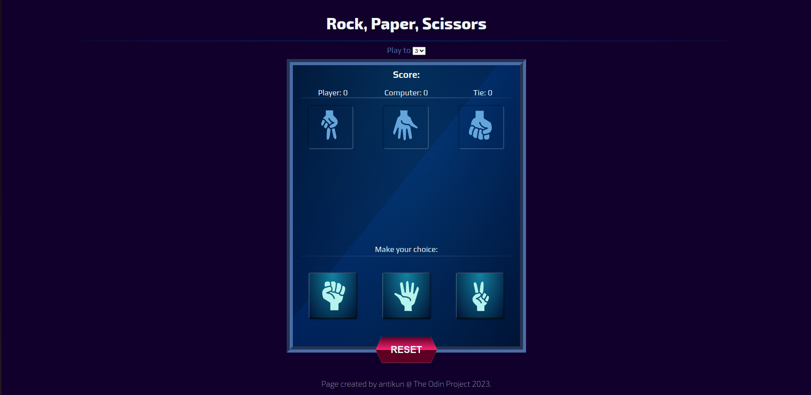
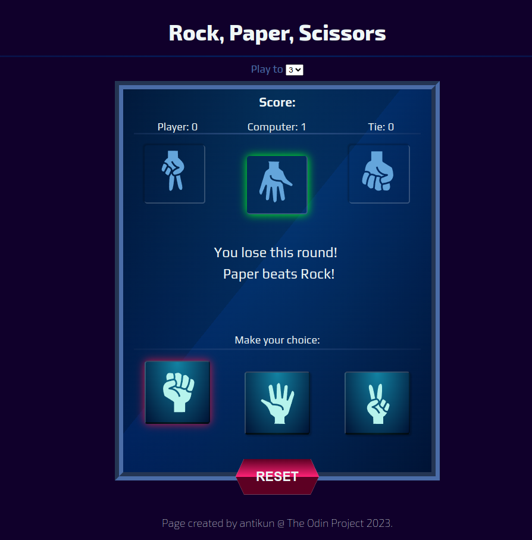
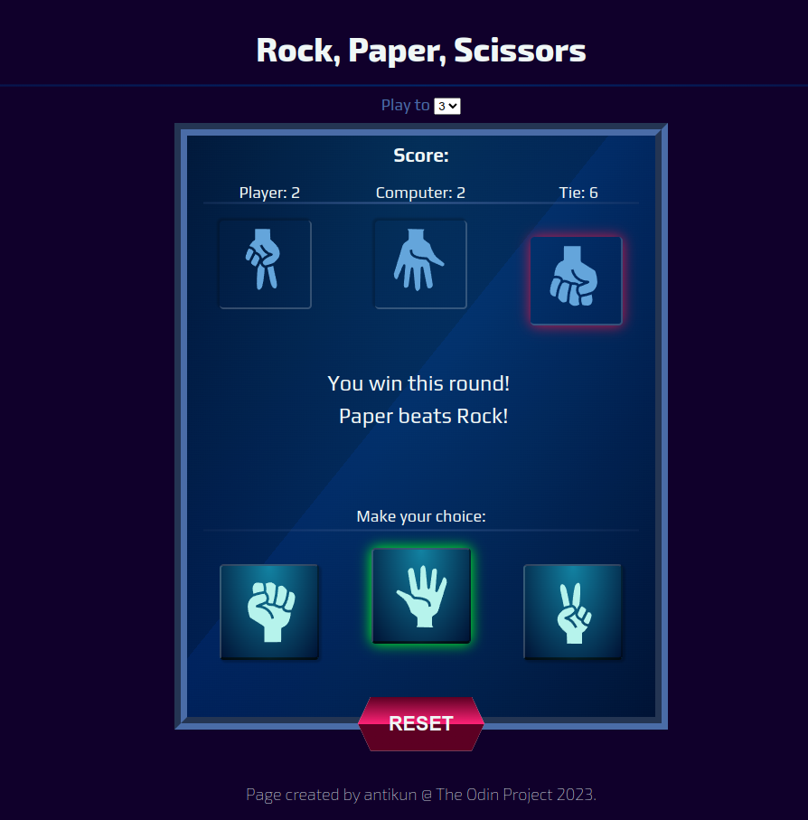
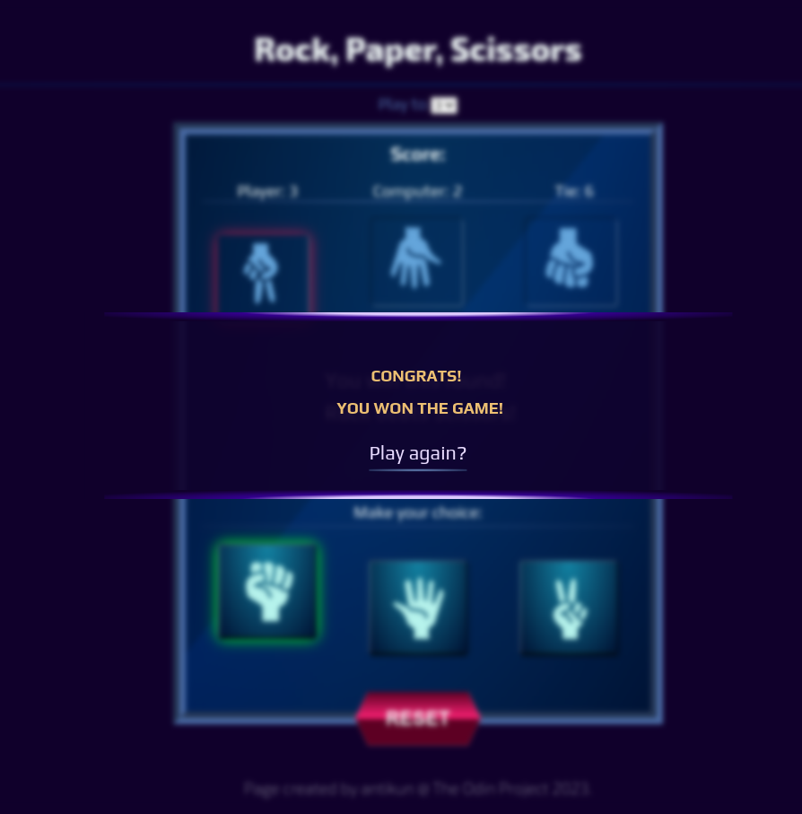

# THE ODIN PROJECT

## Project: Rock, Paper, Scissors</h2>

### Description

Rock, paper, scissors game built with vanilla **HTML**, **CSS**, and **JavaScript** as part of [The Odin Project curriculum](https://www.theodinproject.com/lessons/foundations-rock-paper-scissors).

**Live preview:** [here](https://antikun.github.io/odin-rock-paper-scissors/).

### Aims

The first part of the project was aimed at implementing the JS basics that I have learned so far.
At that point the game consisted of just a few simple functions that would print the outcome in the browser console.

In the second stage of the project I added a Graphical User Interface, for which I had to refactor the old code quite a bit to include event listeners.

### Results

#### Screenshots

* Learned a lot about function declarations and improved my **overall understanding** of how JavaScript works.
* Got better at **refactoring** the code to make it cleaner by combining booleans, object literals, arrays, functions, event listeners, loops, etc in order to **manipulate the DOM**
* Improved my **CSS skills** - **media queries for responsive design, gradients, transitions, pseudo elements**, etc.
* Learned how to make **modals**.

### Things to improve
* Responsive design for mobile devices, small and big(4k) screens.
* Debugging for mobile devices.
* Writing cleaner and more concise code both in JS and CSS.

